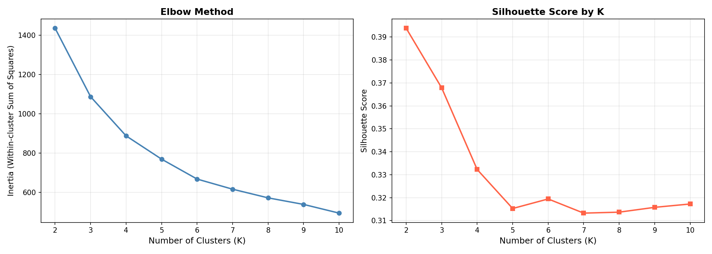
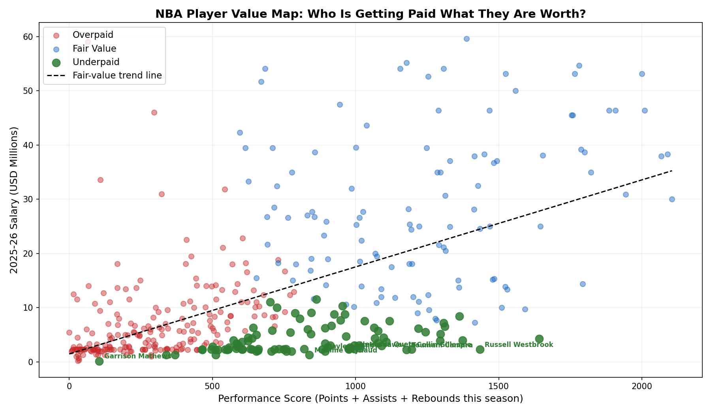
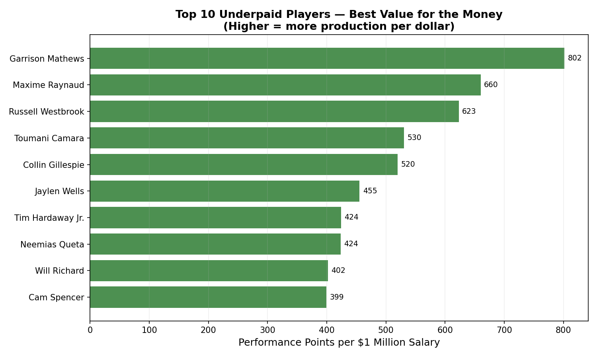
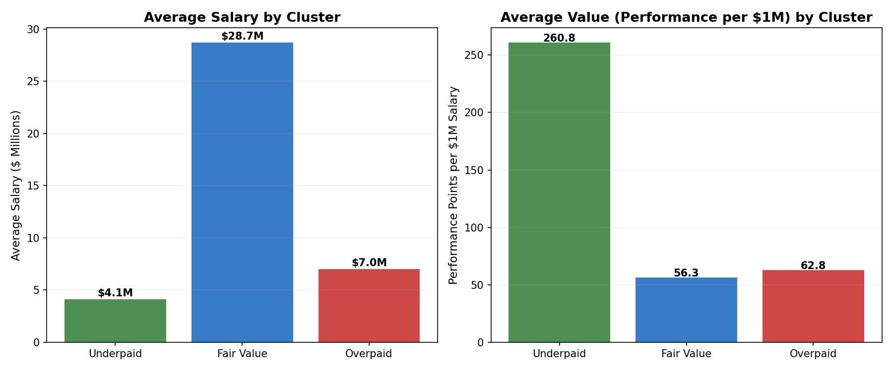

# Finding Hidden Value: An NBA Player Salary Analysis for the Washington Wizards

**Prepared by:** Data Analysis Team
**Data source:** 2025–26 NBA salary data merged with 2024–25 per-season player statistics
**Analysis method:** K-Means Clustering (unsupervised machine learning)

---

## The Problem We Were Trying to Solve

The Washington Wizards, like every NBA franchise, operate under a salary cap — a league-wide spending limit that forces teams to be smart about how they allocate their money. Overpay for one player and you may not have enough left to build a complete roster. The goal of this analysis was simple: **use data to identify players who are producing at a high level but being paid far less than that production is worth.** These are the hidden gems that smart teams target to gain a competitive edge without blowing their budget.

---

## How We Approached It: Grouping Players by "Value"

Rather than eyeballing a spreadsheet, we used a technique called **K-Means Clustering** — a computer algorithm that automatically groups similar things together. Think of it like automatically sorting a pile of mixed coins: you don't decide in advance how to group them; the algorithm finds the natural groupings on its own.

We fed the algorithm four pieces of information about each player:

- **Points per season** — how much they score
- **Assists per season** — how much they set up teammates to score
- **Rebounds per season** — how often they pull down missed shots
- **Minutes played** — how much their coach actually trusts them with court time

We also gave the algorithm each player's **salary** and a calculated **value ratio** (production divided by pay). This last ingredient was the key: without it, two players could look identical in stats but one might be earning $3 million and the other $30 million — a crucial difference the algorithm would otherwise miss.

### Why These Four Stats?

We deliberately avoided using every available statistic. Many NBA stats measure essentially the same thing — for example, field goals made, field goal attempts, two-point makes, and two-point attempts all basically tell you how much someone shoots. Feeding the algorithm six near-identical measurements would be like asking someone to weigh a suitcase six times on the same scale: you get the same answer over and over, and it drowns out the more interesting information. By choosing four distinct, low-overlap stats, we got a cleaner, more meaningful picture of each player's contribution.

---

## Choosing the Right Number of Groups

One challenge with clustering is deciding how many groups to create. We tested every number from 2 to 10 and evaluated each using two measures:

1. **The Elbow Method** — we plotted how "tight" the clusters were at each group count. Like bending your arm, there's a point where adding more groups stops being helpful. That chart is shown below.
2. **The Silhouette Score** — a 0-to-1 measure of how cleanly separated the clusters are. Higher is better.

Both methods pointed toward **3 clusters** as the natural, interpretable number — and three also maps perfectly onto what we actually want to know: *Underpaid*, *Fair Value*, and *Overpaid*.

---

## What the Data Revealed

After running the algorithm and labeling each group, we ended up with this breakdown across all 411 players in the dataset:

| Cluster | # of Players | Avg. Salary | Avg. Performance Score | Value (Perf per $1M) |
|---------|-------------|-------------|------------------------|----------------------|
| Underpaid | 92 | $4.1M | 834 | **260.8** |
| Fair Value | 112 | $28.7M | 1,237 | 56.3 |
| Overpaid | 207 | $7.0M | 299 | 62.8 |

The **Underpaid** cluster stands out immediately. These players earn an average of just $4.1 million — yet they produce a performance score competitive with players making far more. Their value ratio of 260.8 is more than four times better than the other two groups.

The chart below illustrates this visually. Every dot is a player. Green dots are underpaid, blue are fair value, and red are overpaid. Players who sit **above** the dashed trend line are producing more than their salary suggests they should — those are the targets.

---

## The Recommendations

### Best Targets: Underpaid Players

The horizontal bar chart below ranks the top 10 underpaid players by their value score — how many "performance points" they deliver per million dollars of salary.

The standouts from this group are notable:

- **Russell Westbrook** ($2.3M) — A future Hall of Famer still producing 796 points, 342 assists, and 296 rebounds on a near-minimum contract. His per-dollar production is extraordinary.
- **Toumani Camara** ($2.2M) — A versatile wing who contributes across all three pillars (scoring, playmaking, rebounding) for barely more than the league minimum.
- **Maxime Raynaud** ($1.3M) — A young big man with 472 points and 318 rebounds who is essentially playing for free relative to his output.
- **Neemias Queta** ($2.35M) — An elite rebounder (422 boards) who provides interior presence at a bargain price.
- **Tim Hardaway Jr.** ($2.3M) — A proven scorer (763 points) who offers veteran reliability at a fraction of the cost of comparable players.

### Who to Avoid: Overpaid Players

The overpaid cluster contains 207 players who are being paid more than their on-court production justifies. While many are young prospects still developing, signing them at their current contract levels represents poor value right now. Notable caution cases include players earning $2M+ while contributing fewer than 300 combined points, assists, and rebounds for the season.

### Middle-Tier Options: Fair Value

The fair value cluster contains many recognizable stars — **Victor Wembanyama**, **Cooper Flagg**, and **Deni Avdija** all appear here. These are legitimate, high-performing players, but they are paid accordingly. If the Wizards need to fill out their roster with established talent and have cap room to spare, players like **Payton Pritchard** ($7.2M, 1,417 performance score) and **Amen Thompson** ($9.7M, 1,592 performance score) offer solid value within their salary tier.

---

## Putting It All Together

The data paints a clear picture. The NBA salary market is not perfectly efficient — there are players delivering elite production at a fraction of what comparable players earn. This happens for several reasons: young players on rookie contracts before they hit free agency, veterans returning from injury or an off year, and international players who haven't yet commanded market attention.

The Wizards' best path to competitiveness lies in identifying and signing players from the Underpaid cluster **before** the rest of the league catches on. This analysis gives the front office a data-driven shortlist to start from — but ultimately, the numbers are a starting point. Fit, health, age trajectory, and locker room culture all matter too.

**The full player-by-cluster table has been saved to `cluster_all_players.xlsx`** for deeper review. Each cluster has its own sheet, sorted from highest to lowest value ratio.

---

*All charts and tables generated from 2025–26 salary data and 2024–25 NBA per-season statistics. Analysis performed using K-Means Clustering with StandardScaler feature normalization.*
